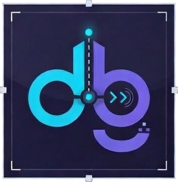

<p align="center">
  
  <br><br>
  <em>Give your agent eyes, not guesses.</em>
  <br>
  A universal debugger CLI that lets AI agents observe runtime state instead of guessing from source code.
</p>

---

> **[Watch the demo](https://redknightlois.github.io/dbg/#demo)** — start a session, hit a breakpoint, inspect state, find the bug.

The bottleneck for agentic engineering is not generation. It is diagnosis.

Without dbg, the agent reads source code, builds a theory, rewrites something, and hopes. Wrong guess? It guesses again. Five cycles of guess-and-rebuild per bug. Tokens, time, and trust — burned.

With dbg, the agent sets a breakpoint, steps to the crash, inspects the variable, and reads the actual value. Root cause on the first pass. One cycle. Done.

One CLI. Many debuggers. The agent learns `dbg` once — it works across Rust, C, C++, Python, Go, .NET, Java, Kotlin, JavaScript, TypeScript, Ruby, PHP, Haskell, OCaml, D, and Nim through a single interface.

## Install

```bash
curl -sSf https://raw.githubusercontent.com/redknightlois/dbg/main/install.sh | sh
```

Or if you already have Rust:

```bash
cargo install dbg-cli
```

## Setup

### For agents

One command installs the skill and all language adapters into your agent's config:

```bash
dbg --init claude    # ~/.claude/skills/dbg/
dbg --init codex     # ~/.codex/skills/dbg/
```

After this, the agent knows how to use `dbg` — no further configuration needed. It picks the right backend, sets breakpoints, and interprets debugger output on its own.

### For humans

There is no human setup. `dbg` is a CLI tool — run it directly or let your agent run it. Check which backends are ready:

```bash
dbg                    # shows all backends and their status
dbg --backend rust     # check dependencies for a specific type
```

## Usage

```
dbg start <type> <target> [--break spec] [--args ...] [--run]
dbg <any debugger command>
dbg help              list available commands
dbg help <command>    ask the debugger what a command does
dbg kill
```

## Try it

### Quick smoke test

No project needed. This confirms dbg and your debugger are working:

```bash
# Python — debug a one-liner that crashes
echo 'x = [1,2,3]; print(x[5])' > /tmp/crash.py
dbg start python /tmp/crash.py
# agent (or you) can now: run, backtrace, print x, kill
```

### Agent prompts

Pick your language and paste the prompt into Claude or Codex:

**Debug a crash**

> `process_batch` in `src/pipeline.rs` panics on empty input. Use dbg to find out why.

**Find a memory leak**

> `./myapp` leaks memory under load. Use dbg to find the source.

**Profile slow code**

> I have a Go CPU profile at `cpu.prof`. Use dbg to find what's hot and why.

**Profile a Python script**

> `scripts/etl.py` takes 40 seconds. Use dbg to find where the time is going.

**Debug a Node.js app**

> `src/server.js` throws a TypeError on the `/api/users` route. Use dbg to find what's undefined and why.

**Profile a Node.js script**

> `scripts/build.js` takes 20 seconds. Use dbg to find where the time is going.

**Profile a .NET app**

> `./MyApp` is burning CPU somewhere in `MyNamespace`. Use dbg to find the bottleneck.

**Debug a Ruby script**

> `app/workers/sync.rb` raises a NoMethodError on nil. Use dbg to find what's nil and why.

**Profile a Ruby script**

> `scripts/import.rb` takes 30 seconds. Use dbg to find where the time goes.

**Debug a Haskell program**

> `src/Parser.hs` produces wrong output for nested expressions. Use dbg to trace evaluation and find where it diverges.

**Profile a Haskell program**

> `app/Main.hs` allocates too much memory. Use dbg to find which functions are responsible.

## Backends

### Debuggers

| Backend | Types | Tool |
|---------|-------|------|
| lldb | rust, c, cpp, zig, d, nim | LLDB |
| pdb | python, py | Python debugger |
| netcoredbg | dotnet, csharp, fsharp | NetCoreDbg |
| delve | go | Delve |
| jdb | java, kotlin | Java Debugger |
| node-inspect | node, js, typescript, ts | Node.js inspector |
| rdbg | ruby, rb | rdbg (debug gem) |
| phpdbg | php | phpdbg |
| ghci | haskell, hs | GHCi (GHC interactive debugger) |
| ocamldebug | ocaml, ml | ocamldebug (bytecode debugger with time-travel) |

### Profilers

| Backend | Types | Tool |
|---------|-------|------|
| pprof | pprof | Go pprof (CPU/memory profiles) |
| perf | perf | Linux perf (hardware counters, sampling) |
| callgrind | callgrind | Valgrind callgrind (instruction-level cost) |
| memcheck | memcheck, valgrind | Valgrind memcheck (memory errors, leaks) |
| massif | massif | Valgrind massif (heap profiling) |
| pstats | pyprofile | Python cProfile (function-level timing) |
| dotnet-trace | dotnet-trace | .NET EventPipe (CPU, GC, contention) |
| nodeprof | nodeprof, js-profile | V8 CPU profiler (--cpu-prof) |
| xdebug | php-profile, xdebug-profile | Xdebug (PHP function-level profiling) |
| stackprof | ruby-profile | StackProf (Ruby CPU sampling) |
| ghc-profile | haskell-profile, hs-profile | GHC cost-centre profiling |

Run `dbg` with no arguments to see which backends are ready on your machine.

Run `dbg --backend <type>` to check dependencies and get install instructions for missing ones.

## How it works

dbg runs the debugger inside a persistent daemon. Instead of starting and stopping a debugger for every command, it spawns the process once in a PTY, keeps it alive behind a UNIX socket, and relays commands from the CLI. The agent talks to `dbg` like any other shell tool — no special protocol, no adapters.

Why this matters:

- **Daemon, not subprocess.** The debugger stays alive across commands. No startup cost per interaction, which is critical when an agent sends dozens of commands per session.
- **PTY, not pipes.** The debugger thinks it's in a real terminal, so it behaves exactly as documented. No pipe-mode quirks, no missing output.
- **Output cleaning.** Backends strip debugger noise — DWARF indexing, thread lifecycle, symbol loading — so the agent gets clean, token-efficient output instead of pages of chatter.
- **One interface, many languages.** A backend trait maps each debugger's commands to a common CLI. The agent learns `dbg break`, `dbg step`, `dbg print` once and it works everywhere.

## What dbg is not

- **Not a DAP server.** It's a CLI that agents call directly, not a protocol they implement.
- **Not an IDE plugin.** It's agent-first. Humans can use it, but the design optimizes for non-interactive, command-driven workflows.
- **Not a debugger.** It wraps LLDB, PDB, Delve, NetCoreDbg, JDB, rdbg, GHCi, ocamldebug, and others under one interface. Pass a source file and it compiles with debug symbols automatically — D, Nim, Haskell, OCaml, Rust, Go, and .NET projects build on the fly.

## Contributing

Adding a new backend is writing a prompt. Each backend implements a trait that describes how to spawn the debugger, detect its prompt, format breakpoints, and clean output. See `src/backend/mod.rs` for the trait and any existing backend (e.g., `lldb.rs`, `delve.rs`) as a template.

## License

MIT
